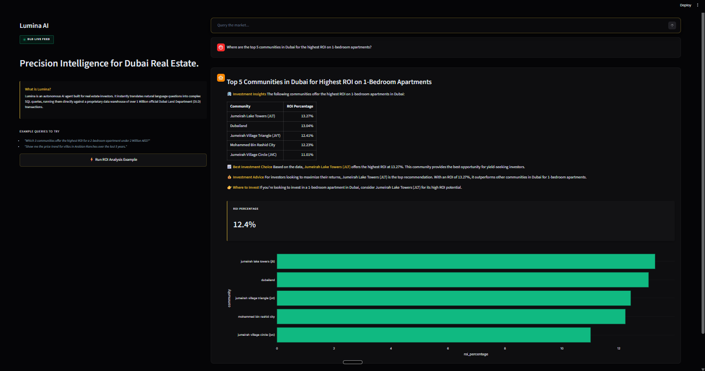

# Lumina: AI-Powered Dubai Real Estate Data Pipeline & Analytics Terminal

Lumina is an end-to-end data engineering and analytics project built to demonstrate how modern AI can interface with large-scale datasets. As a Master's graduate in Data Analytics & AI, my goal was to build a production-grade system from the ground up—handling everything from raw data extraction and ETL to prompt engineering and building an autonomous text-to-SQL agent.

This project synthesizes over **1 Million official Dubai Land Department (DLD) transaction records** with real-time rental listings, turning raw data into actionable investment intelligence through a custom-built Streamlit dashboard.




## Engineering Highlights & Technical Decisions

Instead of relying on heavy ORMs or generic out-of-the-box AI wrappers, I focused on building a lean, highly optimized architecture:

1. **Robust ETL Pipeline**: I built a Python-based pipeline to clean, normalize, and merge massive datasets. This included handling missing values, standardizing community names using regex and string manipulation, and ensuring data integrity before loading.
2. **Choosing DuckDB**: To handle over 1 million records with sub-second analytical query performance, I chose DuckDB over traditional databases like PostgreSQL. Its columnar nature and in-memory execution made it the perfect backend for an AI-driven analytics dashboard.
3. **Conversational SQL Agent**: Instead of basic stateless RAG, I engineered a LangChain-based agent with **full multi-turn conversational memory** using `MessagesPlaceholder`. It maintains context across queries, letting users ask natural follow-up questions (e.g., "What about just for apartments?").
4. **Autonomous Self-Correction Loop**: I built a self-healing debugger into the query cycle. If DuckDB returns a syntax error, the agent catches it, sends the raw traceback back to Llama-3, and self-corrects the SQL in real time before returning a response (supporting up to 3 retries).
5. **Institutional Analytical Framework**: The agent acts as a lead real estate investment analyst. It uses a structured prompt layout to generate high-conviction macro theses, quantitative comparative tables, risk/yield analyses, and targeted investor profile suggestions ("Yield Seekers" vs. "Capital Safety Buyers").
6. **Premium ChatGPT-style UX**: I customized the Streamlit rendering flow using `st.container()` to keep the chat input locked securely at the bottom of the viewport, scrolling Plotly visualizations and automated KPI cards dynamically above it.

## Tech Stack

*   **Data Engineering**: Python, Pandas, DuckDB
*   **AI & Prompt Engineering**: LangChain, Groq API (Llama-3)
*   **Frontend & BI**: Streamlit, Plotly Express

## Project Structure

*   `src/etl/`: Contains the raw data ingestion, cleaning, and transformation scripts.
*   `src/agent/`: Contains the LangChain SQL Agent and the custom system prompts.
*   `app.py`: The Streamlit dashboard serving as the BI terminal.
*   `eda/`: My Exploratory Data Analysis scratchpads documenting data quality checks and feature engineering.

## Setup Instructions

### 1. Environment Setup

Ensure you have Python 3.12+ installed.

```bash
python -m venv venv
# Windows
venv\Scripts\activate
# Mac/Linux
source venv/bin/activate

pip install -r requirements.txt
```

### 2. API Key Configuration

Create a `.env` file in the root directory (you can copy `.env.example`):

```env
GROQ_API_KEY=gsk_YOUR_API_KEY_HERE
DB_PATH=data/processed/transactions.duckdb
```

### 3. Running the ETL Pipeline (Data Generation)

Before running the app, you must build the DuckDB data warehouse. This pipeline cleans, normalizes, and ingests the raw DLD transaction and rental data.

```bash
python -m src.etl.pipeline
```

### 4. Launching the Dashboard

Once the database is built, launch the analytics terminal:

```bash
streamlit run app.py
```
